# Introducción
El objetivo principal de la presente tarea es desarrollar y probar un *MQTT Broker* basado en el protocolo MQTT (Mosquitto).

Por lo tanto, se deberá ejecutar el servicio Mosquitto en la BeagleBone para crear el Broker. Luego, un cliente ESP32 debe publicar los datos de temperatura registrados por un sensor. Además, la aplicación Node-RED debe usarse como cliente para mostrar los datos como una interfaz gráfica de usuario del cliente ESP32.

Finalmente, se implementará un indicador básico de **Alarma** que se encienda cuando la temperatura excede un valor límite o permanezca APAGADO si el valor es menor.


# MQTT Broker 

## Instalación 
Para instalar el servidor Mosquitto en la BeagleBone Black primero se deben actualizar y descargar los paquetes:
```
sudo apt update
sudo apt upgrade
```
Posteriormente, se utiliza el siguiente comando para instalar Mosquitto:
```
sudo apt install mosquitto
```
El servicio se activa con el comando:
```
sudo systemctl enable mosquitto.service
```
Para asegurarse que el servicio se encuentra activo se ejecuta el comando:
```
sudo systemctl status mosquitto.service
```
Y en pantalla aparece el estado del servicio, generalmente marcado en color verde.


## Configuración 
Para realizar cambios en la configuración se debe crear el archivo `mosquitto.conf` con el siguiente contenido:
```
persistence true
listener 1883
persistence_location /var/lib/mosquitto/
connection_messages true
allow_anonymous true
password_file /etc/mosquitto/passwd
```
En este paso es muy importante revisar el puerto en que se está escuchando para modificarlo en caso de que ya este ocupado con otro servicio.

El siguiente paso es cambiar el archivo de configuración por el creado anteriormente y crear el archivo con la contraseña con los siguientes comandos:
```
sudo cp ./mosquitto.conf /etc/mosquitto/mosquitto.conf
sudo touch /etc/mosquitto/passwd
```
**Nota: En este caso no se asigna una contraseña.**

Por último, se reinicia el servicio;
```
sudo systemctl restart mosquitto
```
# Node-RED
## Instalación  
Para instalar Node-RED se deben instalar primero `nodejs` y `npm`:
```
sudo apt update
sudo apt install nodejs
sudo apt install npm
```
Despues se instalarán Node-RED y Dashboard con los comandos:
```
sudo npm install -g --unsafe-perm node-red
node-red-stop
sudo npm install -g --unsafe-perm node-red-dashboard
```
Para ejecutar la aplicación en segundo plano y verificar su ejecución se utiliza:
```
node-red &
sudo netstat -plnt
```
En caso de que el puerto por defecto este siendo ocupado por otro servicio, aparecerá un error como se muestra a continuación:

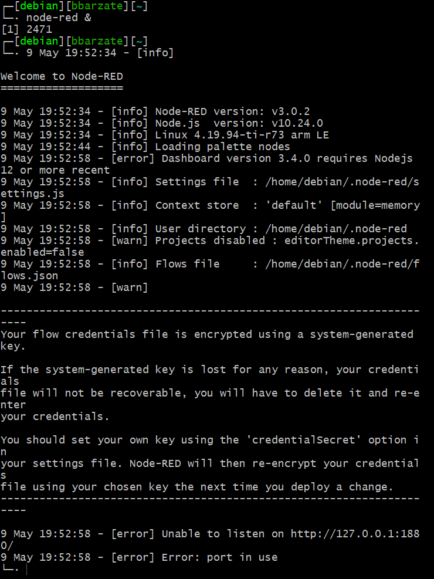

Para lo cual se debe seleccionar un puerto desocupado, en este caso se asigna el puerto 1885 con el comando:
```
 node-red --port 1885
```
**Nota: Si no aparece un mensaje de error, entonces se utilizara el puerto 1880 para acceder a Node-RED.**

Para empezar a utilizar Node-RED en un navegador se accede a la dirección IP de la BeagleBone en el puerto que se está utilizando, en este caso la dirección IP es `192.168.1.205`, por lo tanto, las direcciones para acceder a Node-RED y Dashboard son:
```
192.168.1.205:1885
192.168.1.205:1885/ui
```

## Configuración de Node-RED como cliente

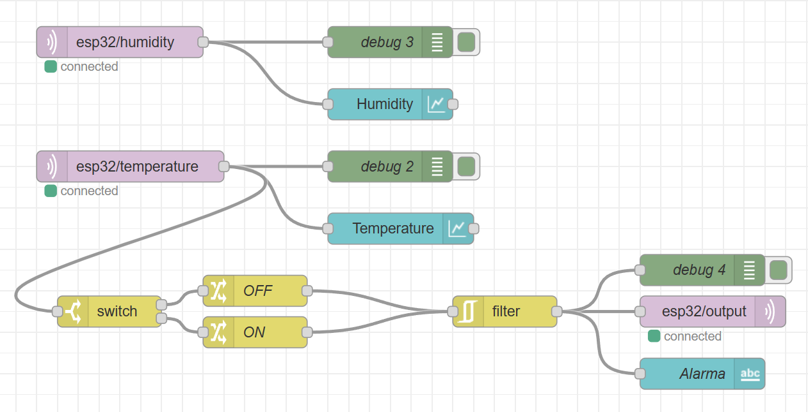
En la figura anterior se muestra el proceso implementado para mostrar los datos en la interfaz gráfica e implementar la alarma. Para ello se utilizaron los siguientes nodos:

- `mqtt in` del grupo `network`. Se utilizan dos nodos de este tipo para obtener la información de humedad y temperatura de los tópicos `esp32/humidity` y `esp32/temperature` respectivamente, estos datos se obtiene del sensor DHT11 y se envían mediante un programa desarrollado en el IDE de Arduino que se mostrara más adelante. En la configuración de estos nodos se debe especificar el tópico del cual obtener los datos. 


- `debug` de `common`. Este nodo no requiere de muchas especificaciones, ya que se basa en mostrar los mensajes de los nodos conectados en la barra lateral con el mismo nombre

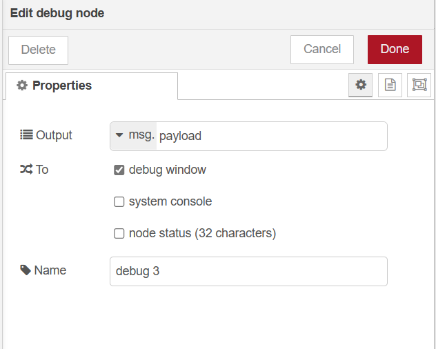

- `chart` y `text` de `dashboard`. Del primer tipo se utilizan dos nodos que muestran en una gráfica los valores de la humedad y la temperatura y text muestra el mensaje de salida de filter.

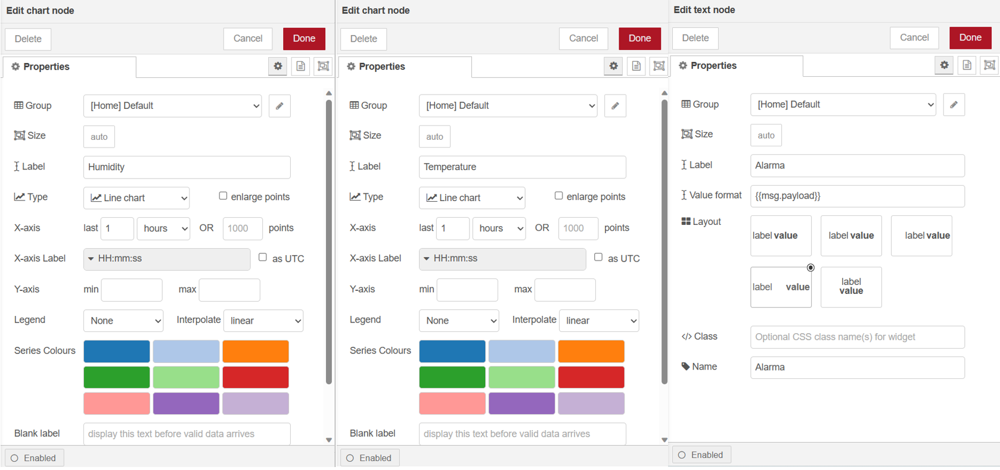

- `switch` de `function`. Permite que su flujo ejecute una de varias rutas posibles según se especifique, este nodo es el equivalente de una condicional `if` en un lenguaje de programación, y en para el proceso define dos salidas dependiendo de la lectura de temperatura que se tenga, si la temperatura es `menor o igual a 29° C` y si la temperatura es `mayor de 29° C`.

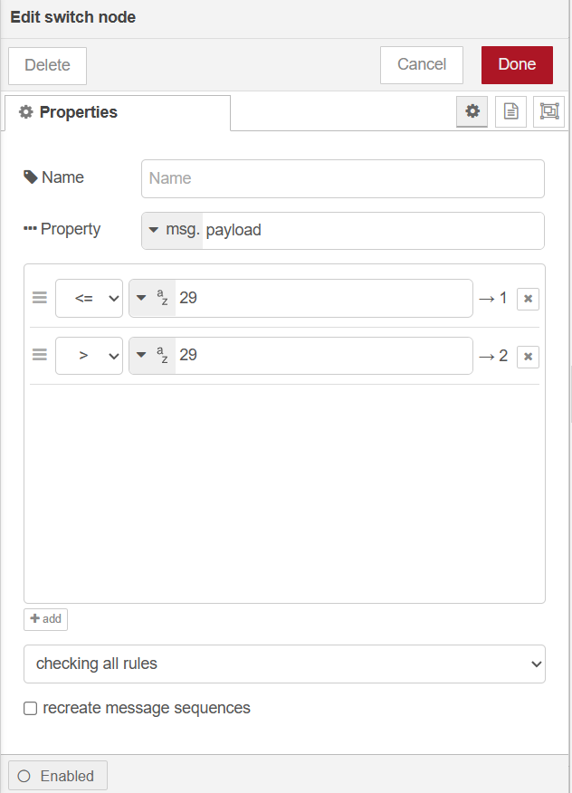

- `change` de `function`. Envía el mensaje `on` si la temperatura sobrepasa los 29° C como se especifica en el switch o en caso contrario envía la palabra `off`.

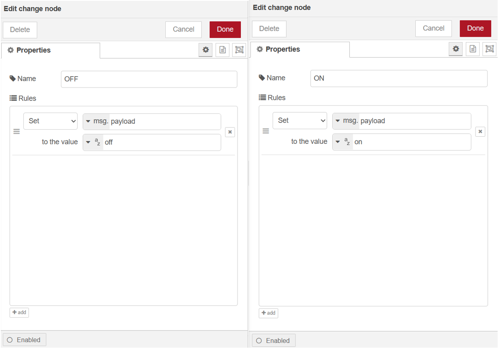

- `filter` de `function`. En este caso se usa para transmitir los datos solo si el mensaje en `change` ha cambiado.

-  `mqtt out` de `network`. Envía el mensaje contenido en filter al tópico esp32/output`.


# MQTTx
Otra manera de visualizar los datos es instalar la aplicación MQTTx que cuenta con una interfaz bastante sencilla de entender y usarlo como cliente. Para instalarlo se utiliza el siguiente comando:
```
sudo snap install mqttx
```

## Configuración de MQTTx como cliente
En el programa se debe crear una nueva conexión haciendo clic en el simbolo `+` en `Connections` y `New Connection`, los campos que se deben modificar son:
- `Name`, se coloca el nombre de la conexión que en este caso es `mosquitto`.
-  `Host`, el cuadro de la parte derecha corresponde a la IP de la BeagleBone Black, 
- `Port`, se debe colocar el puerto en el que está corriendo el servicio, en este caso es el 1883. 
- Por último se debe especificar la versión de MQTT que se instaló en `MQTT Version` y pulsar `Connect`.


Para visualizar los datos se crean 3 suscripciones en `New Subscription` con los nombres `esp32/humidity`, `esp32/temperature` y `esp32/output`.


En la parte inferior de la pantalla en `Payload` se selecciona el tipo de datos `Plaintext` para enviar mensajes y se debe especificar el tópico al cual se desea enviar el mensaje. Los mensajes enviados y recibidos se mostrarán en la pantalla especificando el tópico al que pertenecen.

# Arduino IDE
Para programar el lado del cliente del ESP32 se requiere instalar el Arduino IDE, este se puede descargar desde la página oficial disponible en https://www.arduino.cc/en/software o desde la tienda de aplicaciones. 

Una vez instalado el programa se debe agregar la placa ESP32 desde el menú `Tools -> Board -> Boards Manager`, lo cual abrirá una ventana de búsqueda en la parte izquierda, ingresando `ESP32` se selecciona la opción proporcionada por `Espressif Systems` y se instala.

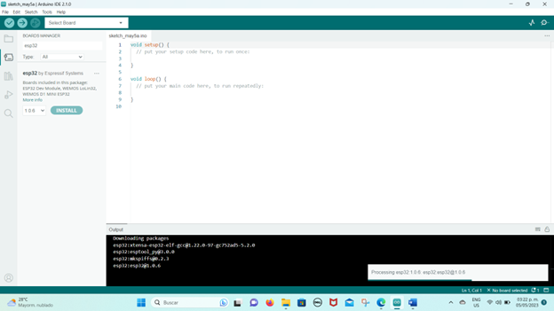

En caso de que la placa no aparezca en la búsqueda, se debe agregar un gestor de paquetes adicional desde el menú `File -> Preferences`, y en `Additional boards manager URLs` se deberá copiar el siguiente enlace:
```
https://dl.espressif.com/dl/package_esp32_index.json 
``` 
Después se presiona `Ok`, se reinicia el programa y nuevamente se deben seguir las instrucciones para añadir la tarjeta ESP32.


Para llevar a cabo la implementación del cliente con el uso del sensor de temperatura y humedad DHT11 se deben incluir las siguientes librerías:

- `PubSubClient` de Nick O'Leary
- `DHT sensor library` de Adafruit
- `Adafruit Unified Sensor` de Adafruit
- `WiFi` de Arduino

Para ello se ingresa al menú `Sketch->Include Library->Manage Libraries` y se busca el nombre de la librería para después instalarlas.

# Conexión de cliente ESP32 
## Código de programación 
En el código se incluyen las librerías antes mencionadas a excepción de `Adafruit Unified Sensor` y se definen el `GPIO 4` para conectar la salida del sensor, el tipo de sensor y el `GPIO 2` para la salida de la alarma que se representara con un led. 

Después en `*ssid` y `*password` se especifican el nombre y contraseña de la red inalámbrica a la que se va a conectar la placa

En la línea 19 empieza la configuración del servidor MQTT:
- `mqttBroker` corresponde a la dirección IP de la BeagleBone Black que como ya se mencionó anteriormente es 192.168.1.205.
- Nuevamente en `*topic` se especifican los 3 tópicos antes mencionados para obtener y enviar información.
- `mqttUsername` y `mqttPassword` se dejan en blanco para la aplicación en la BeagleBone.
- `mqttPort` corresponde al puerto 1883 del servidor. 
```
//Librerias
#include <WiFi.h>
#include <PubSubClient.h>
#include <DHT.h>
//Pines
#define PinSensor 4   // Pin digital al que se conecta el sensor
#define Tipo DHT11    // Tipo de sensor
#define PinLed 2
DHT dht(PinSensor, Tipo);

//Configuración WiFi 
//const char *ssid = "Doctorado"; 
//const char *password = "docInge2018$";  
const char *ssid = "Megcable_2.4G_FD48"; 
const char *password = "thTdXdR7";  
WiFiClient espClient;

// mqtt brocker:
const char *mqttBrocker = "192.168.1.205";
const char *topic = "esp32/output";   
const char *topic2 = "esp32/humidity";
const char *topic3 = "esp32/temperature";   
const char *mqttUsername = "";  //Dejar en blanco para BB
const char *mqttPassword = "";  //Dejar en blanco para BB
const int mqttPort = 1883;
PubSubClient client(espClient);
```

Se declaran variables para guardar los valores de temperatura y humedad y los posibles mensajes que se pueden recibir para activar o desactivar la alarma.

En `void setup` se asigna el led como salida y se intenta realizar la conexión a la red Wifi, una vez que se realiza dicha conexión el programa intenta conectarse al Brocker y envía mensajes en proceso especificando si está intentando conectarse o si se logró o no la conexión.

```

//Variables
char hum[10];
char tem[10];
float humedad;
float temperatura;
char mensajeOn[5] ="on";
char mensajeOff[5] ="off";
char mensaje[5];
int cont = 0;

void setup(){
  pinMode(PinLed , OUTPUT);
  Serial.begin(115200);
  dht.begin();
  WiFi.begin(ssid, password);
  while(WiFi.status() != WL_CONNECTED){
    delay(500);
    Serial.print("Connecting to ");
    Serial.println(ssid); 
  }
  Serial.println("Connection done.");
  //connecting to a mqtt brocker:
  client.setServer(mqttBrocker, mqttPort);
  client.setCallback(callback);
  while(!client.connected()){
    String clientID = "esp32-bere";
    clientID += String(WiFi.macAddress());  //Esta linea se puede quitar
    Serial.printf("The %s tries to connect to mqtt borcker...\n",clientID.c_str());
    if(client.connect(clientID.c_str(), mqttUsername, mqttPassword)){
      Serial.println("mqtt brocker connected");
    }
    else {
      Serial.print("mqtt connection failed");
      Serial.println(client.state());
      delay(2000);
    }
  }
  //once connected publish and suscribe:
  client.publish(topic, "Hi EMQX broker I'm a ESP32 :)");  
  client.subscribe(topic);
}
```

En la parte de `void loop` se guardan las lecturas del sensor, se convierten a tipos de datos adecuados para enviarlos al servidor en sus canales correspondientes, y además, se imprimen en consola.

```
void loop(){
  client.loop();
  humedad = dht.readHumidity();
  temperatura = dht.readTemperature();
  sprintf(hum, "%f", humedad);
  sprintf(tem, "%f", temperatura);
  client.publish(topic2, hum);   //Valor ADC
  client.publish(topic3, tem);   //Valor ADC
  Serial.println("Temperatura:");
  Serial.println(temperatura);
  Serial.println("Humedad: ");
  Serial.println(humedad);
  delay(5000);
}
```
Por último, si se recibe un mensaje en `esp32/output` se imprimen los caracteres del mensaje y se comparan con las variables `mensajeOn` y `mensajeOff` para identificar si se desea encender o apagar la alarma, en función de lo anterior, si el mensaje recibido es `on` se enciende el led y, por el contrario, con `off` se apaga el led.

```
void callback(char *topic, byte *payload, unsigned int length){
  Serial.print("Message recived in topic: ");
  Serial.println(topic);
  Serial.print("The message is: ");
  
  for(int i=0;i<length; i++){
    Serial.print((char) payload[i]);
    sprintf(mensaje, "%c",payload[i]);
    if (mensajeOn[i]==mensaje[0]){
      cont+=1;
      if(cont==2){
        Serial.print("Encender Led");
        digitalWrite(PinLed, HIGH);
        Serial.print(cont);
        cont=0;
      }
    }
    else if(mensajeOff[i]==mensaje[0]){
      cont+=1;
      if(cont==3){
        Serial.print("Apagar Led");
        digitalWrite(PinLed, LOW);
        Serial.print(cont);
        cont=0;
      }
    }
  }
  Serial.println();
  Serial.println("-+-+-+End+-+-+-+");
}
```
## Cargar el programa a la placa ESP32
En el menú `Tools -> Bord` se debe seleccionar `DOIT ESP32 DEVKIT V1` y en `Tools -> Port` se debe seleccionar el puerto en que se conectó en ESP32, en Ubuntu el puerto se selecciona automáticamente, en cambio, en Windows se debe acceder al `Administrador de Dispositivos` en `Puertos COM y LPT` se debe ubicar el puerto que se está utilizando.

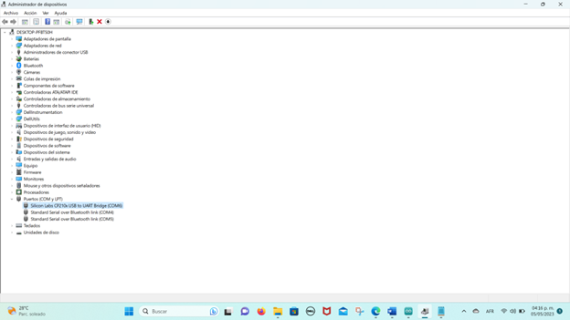

En caso de que no aparezca es posible que no se tenga instalado el driver necesario, el cual se puede obtener de la página oficial `https://www.silabs.com/developers/usb-to-uart-bridge-vcp-drivers?tab=overview `revisando el modelo correspondiente para la placa que se tenga, en este caso fue necesario instalar el `CP210x Universal Windows Driver`.


## Conexión del circuito 

## Resultados 
A continuación se muestran imágenes de las mediciones de los datos del sensor en las diferentes plataformas que se abordaron en este documento. 

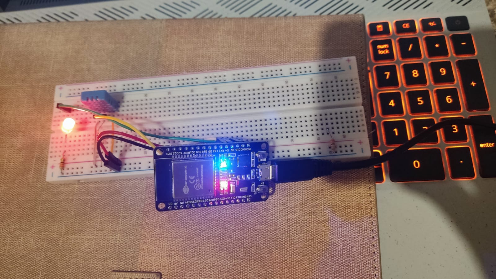

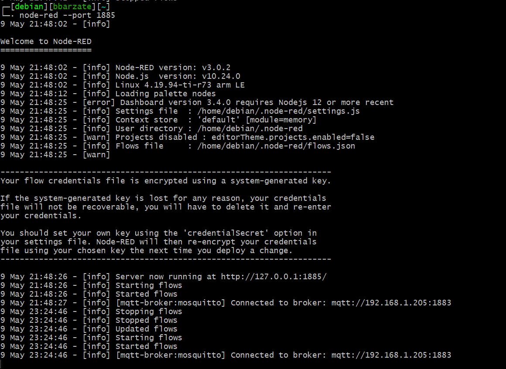

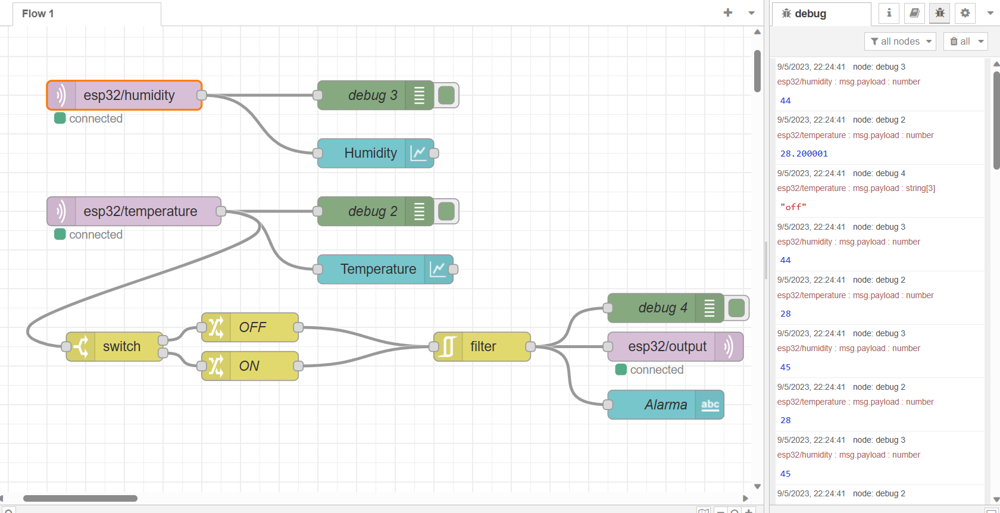

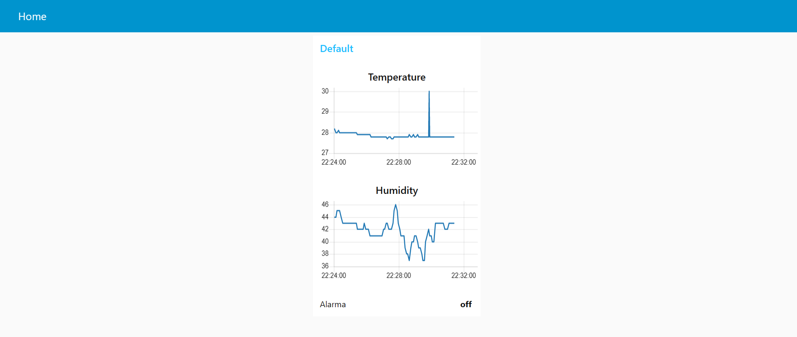

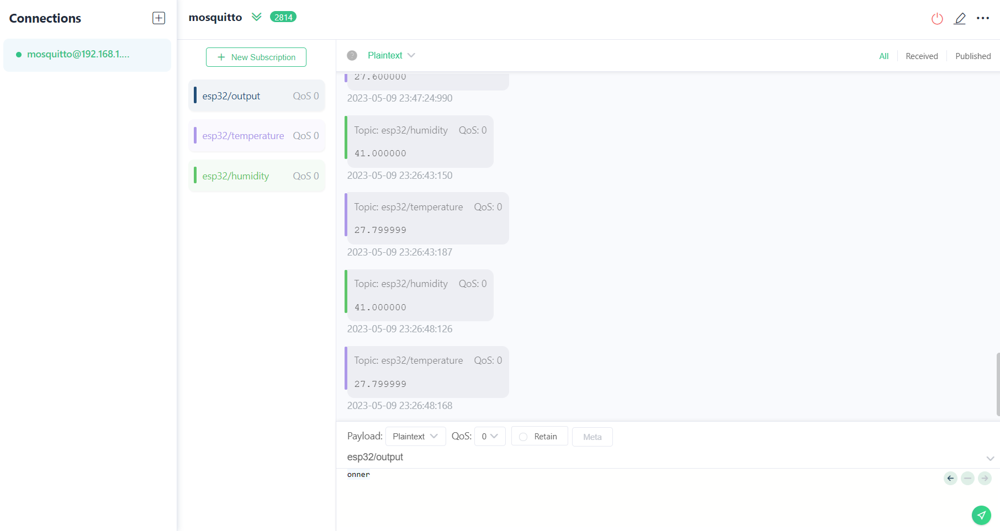

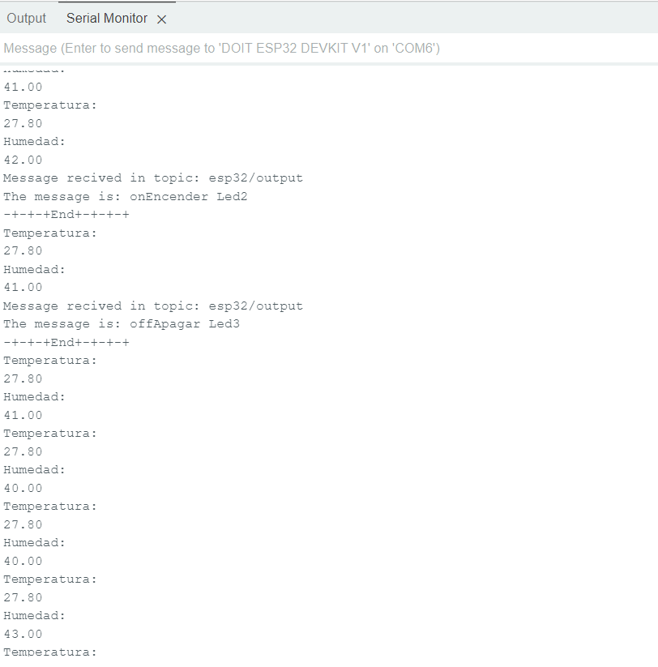


